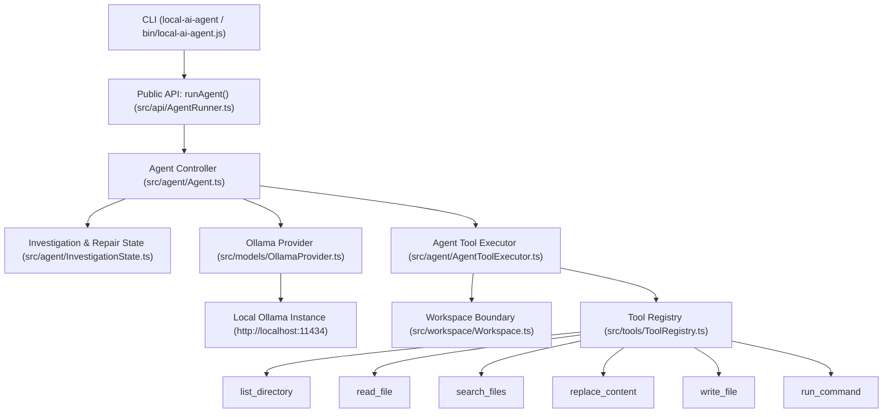

# local-ai-agent

A local autonomous coding agent powered by Ollama and Qwen, featuring a safety-gated repair controller, targeted file mutations, deterministic verification, a public API, and a CLI.

---

## 1. Why This Project Exists

A coding LLM alone is insufficient for autonomous software engineering. Running an LLM directly against a codebase without guardrails leads to destructive full-file overwrites, unverified claims of success, runaway retry loops, and uncontained directory access.

An autonomous coding agent requires controller-level engineering:
- **Controlled Tool Execution**: Strict separation between repository inspection, mutation, and verification phases.
- **Workspace Boundaries**: Sandboxed containment ensuring tools cannot read or write outside the target workspace.
- **Mutation Safety & Repair Gating**: Rejecting arbitrary file edits after verification failures until the model provides concrete repair evidence.
- **Targeted File Modifications**: Preferring surgical text replacement over destructive whole-file overwrites.
- **Authoritative Verification**: Measuring task completion by actual command exit codes (`typecheck`, `test`), never model assertions.
- **Robust Tool Normalization**: Fault-tolerant parsing of Ollama tool calls across raw and fallback formats.

`local-ai-agent` explores and solves these controller-level engineering problems using 100% local model inference.

---

## 2. Architecture



---

## 3. Core Design Principles

### Safety-Gated Mutation
After a verification command (e.g. `npm test` or `tsc`) fails, the agent is **not** permitted to blindly modify arbitrary files. The controller enforces a **repair-evidence rule**: the model must explicitly inspect the implicated files or error locations before subsequent mutations are unlocked.

### Targeted Mutation
The primary file editing tool is `replace_content`, which performs exact substring and line-bounded replacements. This avoids destructive whole-file rewrites, prevents truncation bugs, and preserves existing comments and formatting. If a replacement fails to match, the tool provides bounded diagnostic context around partial matches.

### Workspace Containment
All file read, write, search, and directory operations are bound to a strict `Workspace` root. Paths attempting directory traversal (`../`) outside the configured workspace root are rejected before execution.

### Verification-Driven Completion
An implementation task is never considered successful based on model claims. Completion requires:
1. All required verification categories (such as `typecheck` and `test`) must be explicitly executed.
2. The verification commands must return exit code `0`.
3. If verification fails, the task state remains unverified (`success: false`).

### Local Inference
All reasoning and tool selection run locally via Ollama (`qwen2.5-coder:14b`), keeping code private with zero external cloud dependencies.

---

## 4. Registered Tools

| Tool | Purpose |
| :--- | :--- |
| `list_directory` | Lists files and subdirectories within the workspace boundary. |
| `read_file` | Reads line-bounded slices or entire contents of a workspace file. |
| `search_files` | Searches file paths and regex text patterns across the workspace. |
| `replace_content` | Performs surgical, targeted replacements in existing files with diagnostic feedback. |
| `write_file` | Creates new files or explicitly writes complete files. |
| `run_command` | Executes shell commands (e.g. `npm test`, `tsc`) inside the workspace root. |

---

## 5. Ollama & Model Support

`local-ai-agent` requires a running local Ollama instance:

```bash
# Start Ollama service
ollama serve

# Pull the recommended default model
ollama pull qwen2.5-coder:14b
```

- **Default Model**: `qwen2.5-coder:14b` is the evaluated default for coding accuracy, repair reasoning, and code preservation.
- **Hardware & Context**: Local inference speed is governed by local compute capabilities (Apple Silicon GPU / NVIDIA VRAM) and prompt context length.

---

## 6. Installation & Build

```bash
# Clone repository
git clone https://github.com/namespace7/local-ai-agent.git
cd local-ai-agent

# Install dependencies
npm install

# Compile TypeScript distribution
npm run build
```

This compiles TypeScript source from `src/` to `dist/` and prepares the executable binary wrapper at `bin/local-ai-agent.js`.

---

## 7. CLI Usage

The package exposes the `local-ai-agent` executable:

```bash
# Basic invocation on current working directory
local-ai-agent "Fix the failing tests in src/tests/todo.test.ts"

# Target an external workspace
local-ai-agent --workspace ./my-project "Fix TypeScript compiler errors"

# Override default model or iteration ceiling
local-ai-agent --model qwen2.5-coder:14b --max-iterations 25 "Refactor task service"

# Show help or version
local-ai-agent --help
local-ai-agent --version
```

### Supported CLI Flags:
- `-w, --workspace <path>`: Target workspace directory (default: current directory).
- `-m, --model <model>`: Ollama model name (default: `qwen2.5-coder:14b`).
- `-i, --max-iterations <num>`: Maximum allowed agent iterations (positive integer).
- `-v, --version`: Display package version.
- `-h, --help`: Display help information.

---

## 8. Programmatic API

`local-ai-agent` provides a typed public API for programmatic embedding:

```typescript
import { runAgent, type AgentRunResult } from "local-ai-agent";

const result: AgentRunResult = await runAgent({
  prompt: "Inspect repository, fix failing tests, and verify the solution",
  workspaceRoot: "./my-project", // Defaults to process.cwd()
  model: "qwen2.5-coder:14b",   // Defaults to qwen2.5-coder:14b
  maxIterations: 20,             // Optional iteration override
});

console.log("Success:", result.success);
console.log("Verified:", result.verified);
console.log("Files modified:", result.filesWritten);
console.log("Verification summary:", result.verificationSummary);
```

### `AgentRunResult` Properties:
- `success: boolean`: Authoritative task outcome (`true` only if verified for implementation tasks).
- `taskType: string`: Detected task type (`factual`, `existing-feature`, `implementation-plan`, `implementation`).
- `iterations: number`: Count of model reasoning steps executed.
- `wallClockDurationMs: number`: Total elapsed execution time in milliseconds.
- `finalMessage: string`: Final agent summary or caught error explanation.
- `filesWritten: string[]`: Array of unique file paths modified during execution.
- `verified: boolean`: Indicates whether all required verification categories completed successfully.
- `verificationSummary: VerificationSummary`: Specific pass/fail status for `typecheckPassed` and `testPassed`.
- `trace?: ExecutionTrace`: Authoritative trace of all model events, tool calls, and results.

---

## 9. Verification Lifecycle

```
       [Start]
          ↓
   [Inspect Workspace]  (list_directory, search_files, read_file)
          ↓
  [Diagnose & Plan]
          ↓
   [Mutate Code]        (replace_content, write_file)
          ↓
   [Run Verification]   (npm run typecheck, npm test)
          ↓
    ┌─────┴─────┐
    │           │
 [PASS]      [FAIL]
    │           ↓
    │    [Repair Evidence Gated]  (Must inspect failing files)
    │           ↓
    │    [Re-Mutate Code]
    │           ↓
    │    [Re-Verify]
    │           │
    └───────────┘
          ↓
   [Authoritative Result]
```

A verification failure locks mutation tools until the agent supplies fresh repair evidence by inspecting the implicated error paths.

---

## 10. Validation & Engineering Results

In controlled validation experiments (Run 28 baseline), the frozen controller with `qwen2.5-coder:14b` was evaluated against a multi-defect TypeScript repository fixture containing three independent defect categories (NodeNext ESM imports, business logic state, and collection filter predicates):

- **3 / 3 defects repaired autonomously**
- **`npm run typecheck`**: PASS (exit code 0)
- **`npm run build`**: PASS (exit code 0)
- **`npm test`**: PASS (4/4 test cases passing)
- **0 destructive `write_file` overwrites** (100% surgical `replace_content` mutations)
- **0 unnecessary files created**
- **0 dropped tool calls** across multi-tool fallback responses

*(Note: Results represent controlled benchmark fixtures; performance on arbitrary external repositories varies with codebase size and model reasoning capabilities.)*

---

## 11. Model Evaluation

In a comparative efficiency evaluation on an identical 3-defect repository fixture under a strict **8-iteration budget**:

| Metric | `qwen2.5-coder:14b` | `qwen3:8b` |
| :--- | :--- | :--- |
| **Defects Repaired** | **1 / 3** | **0 / 3** |
| **Runtime (8 iterations)** | 158.7s (2.6 min) | **98.6s (1.6 min)** |
| **Repair Throughput** | **0.38 defects/min** | 0.00 defects/min |
| **Targeted Mutations** | 6 calls | 4 calls |
| **Destructive Overwrites** | **0** | **0** |
| **Attribution Accuracy** | High (targeted application logic) | Low (mutated test assertions) |

**Conclusion**: `qwen2.5-coder:14b` is the recommended default. While smaller models execute iterations faster, `14B` demonstrates the diagnostic reasoning required to distinguish application faults from test assertions.

---

## 12. Known Limitations

- **Inference Latency**: Local LLM execution speed depends directly on available GPU hardware and context window size.
- **Context Prefill Scaling**: Repeated tool execution expands conversational history, increasing prompt prefill duration on long runs.
- **Heuristic Scope**: This repository is an MVP research codebase exploring autonomous controller safety, not a commercial cloud coding product.
- **Repair Convergence**: Autonomous repair success is bounded by model capability, iteration limits, and diagnostic clarity of compiler/test outputs.

---

## 13. Development & Testing

```bash
# Typecheck TypeScript source
npm run typecheck

# Build distribution files
npm run build

# Run all 28 deterministic unit and regression test suites
npm test
```

All 28 deterministic test suites in `src/tests/` run in sub-process sandboxes using mock model sequences without requiring a live Ollama service.

---

## 14. Project Roadmap

- [x] Safety-gated agent controller
- [x] Workspace containment and sandboxing
- [x] Targeted mutations (`replace_content`) with diagnostic context
- [x] Authoritative verification loop
- [x] Ollama integration with multi-tool fallback normalization
- [x] Public programmatic API (`runAgent`)
- [x] Terminal CLI (`local-ai-agent`)
- [ ] Interactive terminal UI improvements
- [ ] Additional model and provider adapters
- [ ] Persistent session and execution history

---

## 15. License

[ISC License](package.json)
